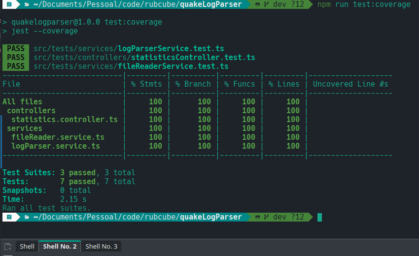
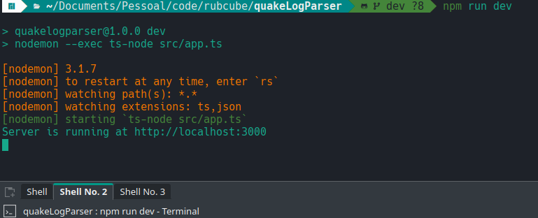
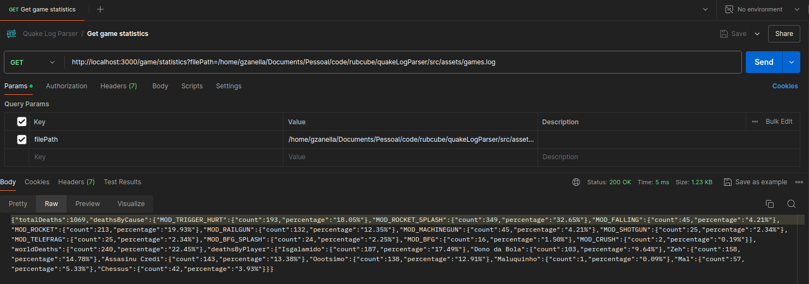
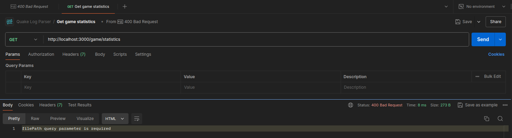
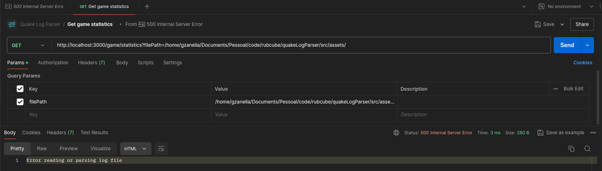

# QuakeLogParser

## Descrição

QuakeLogParser é um projeto para analisar logs de jogos Quake.

Atendendo a seguinte hitória:

Eu como administrador do jogo, quero ter a estatística por jogo, do total de mortes, de mortes por causa e de mortes causadas pelo `<world>` para entender dificuldade dos jogadores.

E com um item a mais no objeto de retorno. Além dos dados pedidos na história, a api retorna também um objeto que contém os jogadores daquela partida e a quantidade de mortes realizada por cada um.

Escolhi está história porque a ideia era fazer as 3, porém devido a compromissos e imprevistos não tive tempo.

## Requisitos

- Node.js v20.9.0
- npm v10.2.4

## Instalação

- Instale as dependências:

  - Rodar `npm install`

- Para rodar o projeto em ambiente de desenvolvimento, utilize o comando:

  - `npm run dev`

- Para chamar a api localmente faça um get na url:
  - http://localhost:3000/game/statistics?filePath=*{coloque aqui o caminho para seu arquivo de logs}*

    - Dentro do projeto em `src/assets` contém um arquivo `games.log` que foi usado para o desenvolvimento, e pode ser usado para chamar a api localmente. 
    - Também contém um arquivo `Quake Log Parser.postman_collection.json`, que pode ser importado no postman com um exemplo de chamada e resposta. Importante lembrar de alterar o caminho para o arquivo de log na chamada da collection.

## Testes

- Rode os scripts criados no package.json `npm run test` ou `npm run test:coverage`.

## Imagens
- Aplicação rodando no terminal

---
- 200 OK

---
- 400 Bad Request 

---
- 500 Internal Server Error
